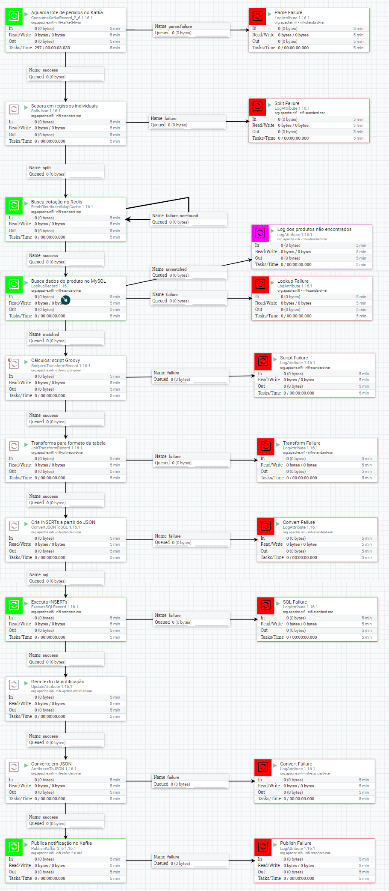

# PoCEventos


Uma prova de conceitos para um sistema web com event streaming.

```
docker-compose up
```

Aplicação em http://localhost:8888/.


Nifi em http://localhost:48443/nifi/.




MySQL na porta 3308, usuário `root` e senha `root`.

```sh
docker exec -it poceventos_mysql mysql -proot
```


redis:
```sh
docker exec -it poceventos_redis redis-cli
```

- `keys *` mostra todas as chaves
- `get cotacao` mostra o valor atual do dólar
- `ttl cotacao` mostra quantos segundos faltam para expirar a cotação atual

# Passos manuais
Configuração do pipeline do Apach Nifi:
- Carregar o template contido em [`pipeline/nifi/PoCEventos.xml`](pipeline/nifi/PoCEventos.xml).
- Colocar a senha `root` do MySQL no controlador do pool de conexões com MySQL.
- Habilitar todos os controladores.
- Habilitar o flow.

# Teste de stress

Instale o [Apache Bench](https://httpd.apache.org/docs/2.4/programs/ab.html):

```sh
sudo apt install apache2-utils
```

Crie um arquivo com o conteúdo do POST:
```sh
echo '{"produtoId":"8fqupa2mp9o6","quantidade":"1"}' > payload.json
```

Dispare quantas vezes quiser:

Sintaxe:
```sh
ab -n QTD_REQUESTS -c QTD_SIMULTANEA -T application/json -p ARQUIVO_JSON_POST http://URL_SERVICO/api/pedidos
```

Exemplo:
```sh
ab -n 30 -c 3 -T application/json -p payload.json http://localhost:8888/api/pedidos
```

# Desenvolvimento

Subir um MySQL para desenvolvimento:
```
docker run --name mysql-dev -p 3307:3306 -e MYSQL_ROOT_PASSWORD=root mysql:8.0.29
```

# TODO
- [ ] Configurar persistência do nifi
- [ ] Automatizar a criação dos templates e dos parâmetros do nifi na inicialização (ver `nifi import-param-context`)
- [ ] Conectar o nifi com o nifi-registry
- [ ] Usar mysql ou git para persistência do nifi-registry
- [ ] Adicionar testes de infra com [FluentDocker](https://github.com/mariotoffia/FluentDocker)
- [ ] Criar IaC com Terraform e AWS
